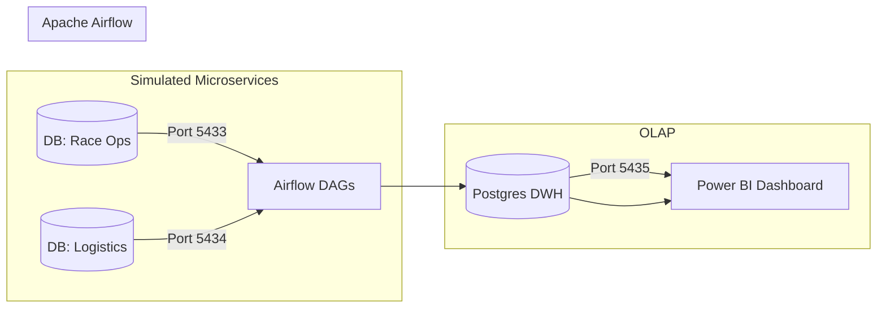

# 🏎️ Formula 1 End-to-End Data Engineering Project

An end-to-end Data Warehouse project that simulates a real-world microservices environment. It ingests Formula 1 data from distributed transactional databases, transforms it using an ELT pipeline orchestrated by Airflow, and visualizes race insights via Power BI.

## 🏗️ System Architecture

The project simulates a distributed system where data is decoupled into specific domains (Microservices architecture) before being consolidated into a Data Warehouse.



### Components

1. **Service 1: Race Operations (Telemetry)**
* **Type:** Transactional (OLTP)
* **Port:** `5433`
* **Content:** High-volume data: `lap_times`, `pit_stops`, `qualifying`, `race_results`.


2. **Service 2: Participant Reference (Logistics)**
* **Type:** Master Data (OLTP)
* **Port:** `5434`
* **Content:** Reference data: `drivers`, `constructors`, `circuits`, `seasons`.


3. **Data Warehouse (DWH)**
* **Type:** OLAP (Star Schema)
* **Port:** `5435`
* **Content:** Fact tables and Dimension tables optimized for analytics.


## 📂 Project Structure

```bash
├── dags/                   # Airflow DAGs (Python code for ELT)
├── db_scripts/             # SQL scripts for database initialization
│   ├── source_telemetry.sql
│   ├── source_logistics.sql
│   └── dwh_schema.sql
├── docker-compose.yml      # Infrastructure setup
└── README.md               # Project Documentation

```

## 🚀 Getting Started

### Prerequisites

* Docker & Docker Compose
* DBeaver (or any SQL Client)
* Power BI Desktop (for visualization)

### Installation & Setup

1. **Clone the repository**
```bash
git clone https://github.com/Hanhiz/f1-dwh-project.git
cd f1-data-engineering

```


2. **Start Infrastructure**
Run the docker-compose file to spin up 4 database containers and Airflow services.
```bash
docker-compose up -d

```


3. **Initialize Databases**
Connect to the databases using DBeaver (User/Pass: see `docker-compose.yml`) and run the scripts in `db_scripts/`:
* Run `source_telemetry.sql` on `localhost:5433`
* Run `source_logistics.sql` on `localhost:5434`
* Run `dwh_schema.sql` on `localhost:5435`


4. **Access Airflow**
* Go to `http://localhost:8080`
* Login with `admin` / `admin`
* Trigger the DAGs to start the ELT process.


## 📊 Dashboard & Insights

The Power BI Dashboard (`bi/f1_dashboard.pbix`) connects to the DWH to provide insights such as:

* Driver Performance Analysis across seasons.
* Constructor Championship points tracking.
* Pitstop efficiency and correlation with race results.

## 🛡️ Key Features

* **Microservices Simulation:** Handles cross-database joins logic within the pipeline.
* **Automated Pipeline:** Airflow schedules extract, load, and transform tasks.
* **Data Modeling:** Implements Star Schema (Fact/Dimensions) for query performance.
* **Containerization:** Fully isolated environment using Docker.